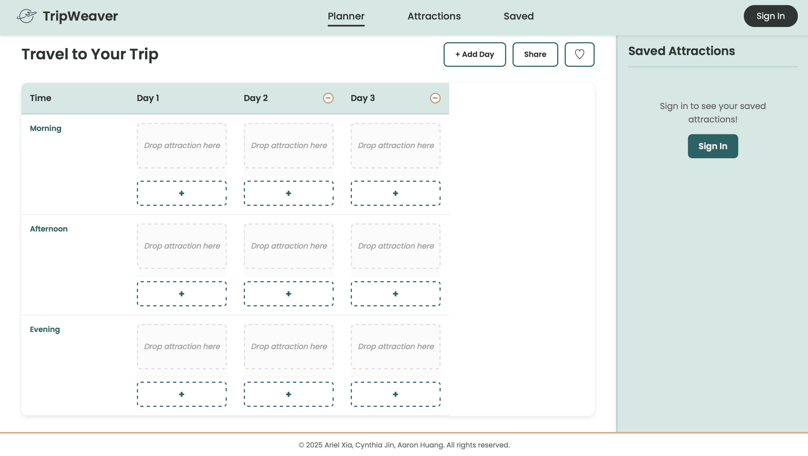
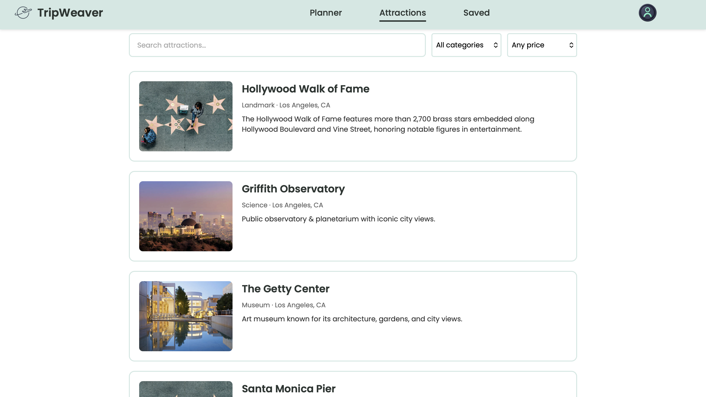
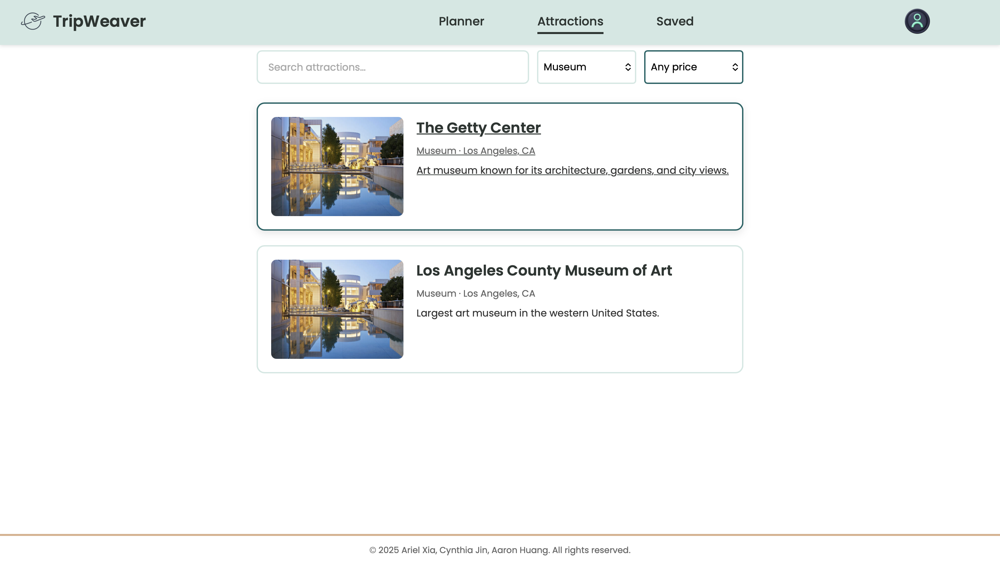
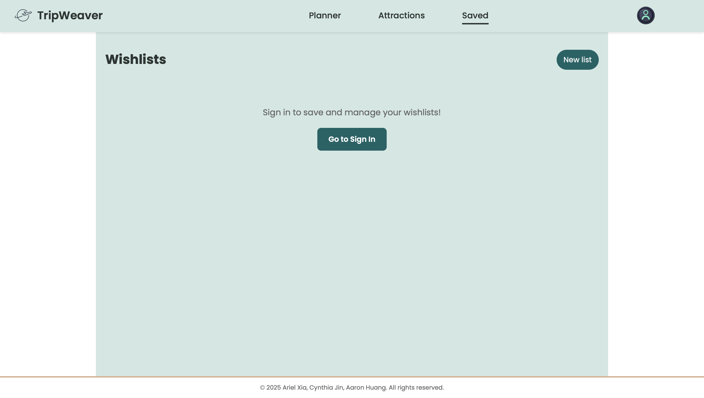

# 🌍 TripWeaver - Travel Itinerary Planner

A modern, cloud-connected travel planning application that helps you discover attractions, organize wishlists, and create detailed day-by-day itineraries with an intuitive drag-and-drop interface.

**Live Demo:** [TripWeaver on Firebase](https://info340project-432e9.web.app)

---

## 👥 Team

- **Ariel Xia** - arielx@uw.edu
- **Cynthia Jin** - cynthiaj@uw.edu  
- **Aaron Huang** - bh62@uw.edu

**Course:** INFO 340 - Client-Side Web Development  
**University of Washington** | Autumn 2024

---

## ✨ Features

### 🗺️ Attraction Discovery
- Browse curated attractions from popular destinations
- Search and filter by category (Museums, Landmarks, Parks, etc.)
- Filter by price range (Free, $, $$, $$$)
- View detailed information including hours, ratings, and descriptions
- Integration with OpenTripMap API for worldwide attraction data
- Google Maps links for navigation

### 💾 Smart Wishlists
- Save attractions to custom-named folders
- Organize trips by destination (LA, Paris, NYC, etc.)
- Cloud storage with Firebase Firestore
- Real-time synchronization across all devices
- View and manage all saved attractions by folder
- Delete folders and attractions with confirmation

### 📅 Interactive Planner
- Drag-and-drop scheduling interface
- Organize attractions by day and time (Morning, Afternoon, Evening)
- Add unlimited days to your itinerary
- Multiple time slots per period
- Dynamic trip title based on selected destination folder
- Collaborative sharing with team members
- Export-ready format for your trips

### 🔐 User Authentication
- Secure Firebase Authentication
- Email/password sign-up and sign-in
- Password reset functionality
- User-specific data isolation
- Persistent sessions

### ☁️ Cloud Integration
- **Firebase Firestore** - NoSQL database for wishlists
- **Firebase Hosting** - Fast, secure hosting
- **Firebase Authentication** - Secure user management
- Multi-device sync - Access your plans anywhere
- Offline-capable with fallback data

---

## 🛠️ Tech Stack

### Frontend
- **React 18** - Component-based UI framework
- **Vite** - Fast build tool and dev server
- **CSS3** - Custom styling with responsive design
- **HTML5** - Semantic markup

### Backend & Services
- **Firebase Authentication** - User management
- **Cloud Firestore** - NoSQL database
- **Firebase Hosting** - Static site hosting
- **OpenTripMap API** - Attraction data (optional)

### Development Tools
- **npm** - Package management
- **ESLint** - Code quality
- **Git & GitHub** - Version control
- **VS Code** - Development environment

---

## 🚀 Getting Started

### Prerequisites

- **Node.js** (v18 or higher) - [Download](https://nodejs.org/)
- **npm** (comes with Node.js)
- **Firebase account** - [Sign up](https://firebase.google.com/)
- **Git** - [Download](https://git-scm.com/)

### Installation

#### 1. Clone the Repository

```bash
git clone https://github.com/your-username/tripweaver.git
cd tripweaver
```

#### 2. Install Dependencies

```bash
npm install
```

#### 3. Firebase Setup

**Create Firebase Project:**

1. Go to [Firebase Console](https://console.firebase.google.com/)
2. Click **"Add project"**
3. Name it (e.g., "TripWeaver")
4. Disable Google Analytics (optional)
5. Click **"Create project"**

**Enable Authentication:**

1. In Firebase Console → **Authentication**
2. Click **"Get started"**
3. Enable **"Email/Password"** provider
4. Click **"Save"**

**Enable Firestore:**

1. In Firebase Console → **Firestore Database**
2. Click **"Create database"**
3. Choose **"Start in test mode"**
4. Select your region (e.g., `us-central`)
5. Click **"Enable"**

**Add Security Rules:**

1. Go to **Firestore Database** → **Rules** tab
2. Replace with:

```javascript
rules_version = '2';
service cloud.firestore {
  match /databases/{database}/documents {
    match /savedAttractions/{attractionId} {
      allow read, write: if request.auth != null && 
                           request.resource.data.userId == request.auth.uid;
    }
    match /wishlistFolders/{folderId} {
      allow read, write: if request.auth != null && 
                           request.resource.data.userId == request.auth.uid;
    }
  }
}
```

3. Click **"Publish"**

**Get Firebase Config:**

1. In Firebase Console → **Project Settings** (⚙️ icon)
2. Scroll to **"Your apps"** → Click **Web** icon `</>`
3. Register app (name: "TripWeaver")
4. Copy the `firebaseConfig` object

#### 4. Configure Firebase in Project

**Update `src/firebase.js` with your config:**

```javascript
const firebaseConfig = {
  apiKey: "YOUR_API_KEY",
  authDomain: "YOUR_PROJECT_ID.firebaseapp.com",
  projectId: "YOUR_PROJECT_ID",
  storageBucket: "YOUR_PROJECT_ID.appspot.com",
  messagingSenderId: "YOUR_SENDER_ID",
  appId: "YOUR_APP_ID"
};
```

#### 5. Run Development Server

```bash
npm run dev
```

Visit **http://localhost:5173** in your browser!

---

## 📖 Usage Guide

### First Time Setup

1. **Sign Up**
   - Click **"Sign In"** button
   - Click **"Create Account"**
   - Enter email and password
   - Click **"Sign Up"**

2. **Browse Attractions**
   - Navigate to **Attractions** page
   - Browse available attractions
   - Use filters to narrow results

3. **Save Your First Attraction**
   - Click any attraction card
   - Click **"♡ wish"** button
   - Click **"Save"** in confirmation
   - Select existing folder or create new
   - Click **"Save"**

4. **View Your Wishlists**
   - Navigate to **Saved** page
   - See your folders with attraction counts
   - Click folder to view all attractions
   - Click attraction to see details

5. **Plan Your Trip**
   - Navigate to **Planner** page
   - Select folder from dropdown
   - Drag attractions to schedule
   - Add more days as needed
   - Share with collaborators

---

## 🎨 Application Structure

### Page Navigation

```
├── Planner (Home)
│   ├── Day-by-day schedule
│   ├── Drag-and-drop interface
│   └── Saved attractions sidebar
│
├── Attractions
│   ├── Browse all attractions
│   ├── Search and filter
│   └── Click to view details
│
└── Saved
    ├── View all folders
    ├── Click folder → View attractions
    └── Edit/delete folders
```

### Data Flow

```
User saves attraction
    ↓
AttractionDetail → Firebase Firestore
    ↓
refreshWishlists() called
    ↓
App.jsx loads updated data
    ↓
All pages update automatically
    ↓
Planner shows in dropdown
Saved shows in folder list
```

---

## 📁 Project Structure

```
tripweaver/
├── public/
│   └── img/                      # Images and icons
│       ├── webpage-brand-logo.png
│       ├── profile.png
│       └── [attraction-images]/
│
├── src/
│   ├── App.jsx                   # Main app component with routing
│   ├── PlannerPage.jsx          # Drag-and-drop trip planner
│   ├── SavedPage.jsx            # Wishlist management
│   ├── AttractionSearch.jsx     # Browse and search attractions
│   ├── AttractionDetail.jsx     # Detailed attraction view
│   ├── AuthModal.jsx            # Sign in/up modal
│   │
│   ├── firebase.js              # Firebase configuration
│   ├── AttractionFirebaseService.js  # Firestore operations
│   ├── attractionsData.js       # Static fallback data
│   ├── attractionService.js     # OpenTripMap API integration
│   │
│   ├── index.css                # Global styles
│   └── main.jsx                 # App entry point
│
├── firebase.json                # Firebase hosting config
├── package.json                 # Dependencies
├── vite.config.js              # Vite configuration
└── README.md                    # This file
```

---

## 🎯 Key Components

### App.jsx
- **State Management** - Manages wishlists and selected folder
- **Authentication** - Tracks user login state
- **Routing** - Switches between pages
- **Data Refresh** - Coordinates updates across components

### PlannerPage.jsx
- **Folder Selection** - Dropdown to choose destination
- **Dynamic Title** - Changes based on selected folder
- **Drag-and-Drop** - HTML5 drag API for scheduling
- **Day Management** - Add/remove days
- **Collaboration** - Share modal for team planning

### SavedPage.jsx
- **Folder View** - Grid of wishlist folders
- **Attraction View** - List of attractions in folder
- **Navigation** - Click folder → attractions → detail
- **Edit Mode** - Select and delete folders

### AttractionDetail.jsx
- **Save Functionality** - Add to wishlist with folder selection
- **Create Folders** - New folder creation inline
- **Duplicate Detection** - Prevents saving same attraction twice
- **Refresh Trigger** - Updates all pages after save

---

## 🔥 Firebase Integration

### Collections Structure

**savedAttractions** collection:
```javascript
{
  documentId: "userId_folderName_attractionId",
  userId: "firebase-user-id",
  folderName: "LA",
  attractionId: "griffith-observatory",
  name: "Griffith Observatory",
  category: "Observatory",
  location: "Los Angeles, CA",
  coordinates: { lat: 34.1184, lng: -118.3004 },
  rating: 5,
  price: "Free",
  description: "...",
  image: "/img/griffith.png",
  features: [...],
  hours: "Tuesday-Friday 12:00-22:00",
  savedAt: "2024-12-07T01:30:00Z"
}
```

**wishlistFolders** collection:
```javascript
{
  documentId: "userId_folderName",
  userId: "firebase-user-id",
  folderName: "LA",
  createdAt: "2024-12-07T01:30:00Z"
}
```

### Security Rules

- Users can only read/write their own data
- Authentication required for all operations
- User ID validation on every request

---

## 🌐 Deployment

### Build for Production

```bash
# Build optimized production files
npm run build
```

This creates a `dist/` folder with:
- Minified JavaScript
- Optimized CSS
- Compressed images
- Production-ready HTML

### Deploy to Firebase

#### First-Time Setup

```bash
# Install Firebase CLI
npm install -g firebase-tools

# Login to Firebase
firebase login

# Initialize Firebase in project
firebase init hosting

# Select options:
# - Use existing project: info340project-432e9
# - Public directory: dist
# - Single-page app: Yes
# - Overwrite index.html: No
```

#### Deploy Updates

```bash
# Build latest version
npm run build

# Deploy to Firebase Hosting
firebase deploy --only hosting

# Visit your live site!
# https://info340project-432e9.web.app
```

### Deployment Workflow

```bash
# 1. Make code changes
# 2. Test locally
npm run dev

# 3. Build for production
npm run build

# 4. Deploy to Firebase
firebase deploy --only hosting

# 5. Verify deployment
# Visit https://info340project-432e9.web.app
```

---

## 🧪 Testing

### Local Testing

```bash
# Start dev server
npm run dev

# Test in browser
open http://localhost:5173
```

### Test Checklist

**Authentication:**
- [ ] Sign up new account
- [ ] Sign in existing account
- [ ] Sign out
- [ ] Password validation

**Attractions:**
- [ ] Browse attractions
- [ ] Filter by category
- [ ] Filter by price
- [ ] Click attraction → Detail page
- [ ] Back to search

**Save/Wishlist:**
- [ ] Save to existing folder
- [ ] Create new folder
- [ ] Save multiple attractions
- [ ] View in Saved page
- [ ] Click folder → See attractions
- [ ] Delete folder

**Planner:**
- [ ] Select folder from dropdown
- [ ] Title updates correctly
- [ ] Attractions appear in sidebar
- [ ] Drag to schedule
- [ ] Remove from schedule
- [ ] Add/remove days
- [ ] Share modal

**Cross-Device:**
- [ ] Save on Device A
- [ ] See on Device B
- [ ] Delete on Device B
- [ ] Removed from Device A

---

## 🐛 Troubleshooting

### "No saved attractions yet" after saving

**Problem:** Data not loading from Firestore

**Solutions:**
1. Check if Firestore is enabled in Firebase Console
2. Verify security rules are published
3. Hard refresh browser (`Ctrl+Shift+R`)
4. Check browser console for errors
5. Verify `attractionFirebaseService.js` exists in `src/`

### "Permission denied" errors

**Problem:** Firestore security rules blocking access

**Solution:**
1. Go to Firebase Console → Firestore → Rules
2. Verify rules allow authenticated users
3. Click "Publish"
4. Sign out and sign in again

### Firebase deploy shows old version

**Problem:** Not building before deploying

**Solution:**
```bash
npm run build  # Build first!
firebase deploy --only hosting
```

### Import errors in VS Code

**Problem:** Case-sensitive file names

**Solution:**
- Files must be lowercase: `attractionFirebaseService.js`
- Not: `AttractionFirebaseService.js`
- Rename and restart dev server

---

## 🎨 Customization

### Add New Destinations

**Update destination mapping in `PlannerPage.jsx`:**

```javascript
const getDestinationFromFolder = () => {
  const folderLower = selectedFolder.toLowerCase();
  
  if (folderLower.includes('seattle')) {
    return 'Seattle, WA';
  }
  if (folderLower.includes('tokyo')) {
    return 'Tokyo, Japan';
  }
  // Add more destinations...
  
  return selectedFolder; // Default
};
```

### Add Static Attractions

**Edit `src/attractionsData.js`:**

```javascript
export const attractions = [
  {
    id: 'your-attraction-id',
    name: 'Space Needle',
    category: 'Landmark',
    location: 'Seattle, WA',
    coordinates: { lat: 47.6205, lng: -122.3493 },
    rating: 5,
    price: '$$',
    description: 'Iconic Seattle landmark...',
    image: '/img/space-needle.png',
    features: ['Observation Deck', 'Restaurant', 'Gift Shop'],
    hours: 'Daily 9:00-22:00'
  }
];
```

### Change Color Scheme

**Update CSS variables in `src/index.css`:**

```css
:root {
  --primary-color: #0F6466;    /* Teal */
  --secondary-color: #D2E8E3;  /* Mint */
  --accent-color: #DBB08C;     /* Beige */
}
```

---

## 📊 Features Roadmap

### Completed ✅
- [x] User authentication
- [x] Attraction browsing
- [x] Save to wishlists
- [x] Folder organization
- [x] Drag-and-drop planner
- [x] Cloud sync
- [x] Responsive design

### In Progress 🚧
- [ ] OpenTripMap API integration
- [ ] Social sharing
- [ ] Email invitations

### Future Features 💡
- [ ] Export itinerary as PDF
- [ ] Weather integration
- [ ] Budget calculator
- [ ] Collaborative real-time editing
- [ ] Mobile app (React Native)
- [ ] Offline mode
- [ ] Trip recommendations
- [ ] Photo uploads

---

## 🤝 Contributing

This is a class project, but we welcome feedback!

**To report bugs or suggest features:**

1. Open an issue on GitHub
2. Email the team
3. Fork and submit a pull request

**Development Guidelines:**

- Follow existing code style
- Comment complex logic
- Test before committing
- Update README for new features

---

## 📄 License

© 2024 Ariel Xia, Cynthia Jin, Aaron Huang. All rights reserved.

**Academic Use:** This project was created for INFO 340 at the University of Washington.

**Reuse:** Please contact the team for permission to use or adapt this project.

---

## 📞 Contact & Support

**Team Emails:**
- Ariel Xia: arielx@uw.edu
- Cynthia Jin: cynthiaj@uw.edu
- Aaron Huang: bh62@uw.edu

**GitHub:** [github.com/your-repo/tripweaver](https://github.com)

**Live Site:** [info340project-432e9.web.app](https://info340project-432e9.web.app)

---

## 🙏 Acknowledgments

- **Professor Joel Ross** - INFO 340 Instructor
- **Teaching Assistants** - For guidance and support
- **OpenTripMap** - Attraction data API
- **Firebase** - Cloud infrastructure
- **React Community** - Documentation and resources
- **UW iSchool** - Educational support

---

## 📸 Screenshots

### Planner Page


### Attractions Browser


### Saved Wishlists


### Attraction Details


---

## 🎓 Educational Outcomes

This project demonstrates:

✅ **React Fundamentals** - Components, props, state, hooks  
✅ **Firebase Integration** - Auth, Firestore, Hosting  
✅ **API Integration** - RESTful API consumption  
✅ **State Management** - Lifting state, prop drilling  
✅ **User Authentication** - Secure login/signup flows  
✅ **Database Design** - NoSQL schema design  
✅ **Responsive Design** - Mobile-first CSS  
✅ **Version Control** - Git workflow and collaboration  
✅ **Deployment** - Production build and hosting  
✅ **User Experience** - Intuitive UI/UX design  

---

**Built with ❤️ by the TripWeaver Team**

*Making travel planning simple, organized, and collaborative.*
